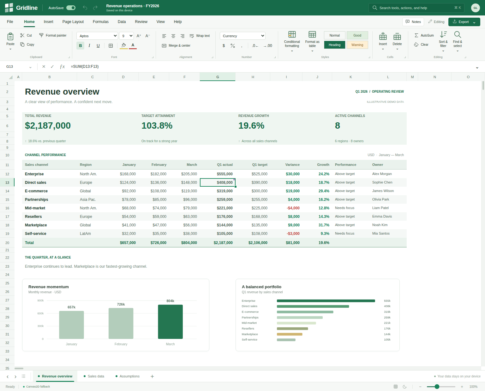

# Gridline

[Open Gridline](https://wieslawsoltes.github.io/Gridline/) · [Build and deployment](https://github.com/wieslawsoltes/Gridline/actions)

**A clearer way to work.** An independent, Excel-inspired spreadsheet application built with plain HTML, CSS, and JavaScript. The grid has a WebGPU rendering backend, a Canvas2D fallback, a real formula interpreter, transactional editing, and local workbook storage. No framework, CDN, account, application server, or runtime package dependencies.

**Version 0.1.0 — engineering preview.** This is working software with a substantial, tested feature set, not a complete replacement for Excel. Compatibility and performance boundaries are explicit below and in the application's **Help → About & limitations** dialog.



## Run

For immediate use, open **`dist/index.html`**. This single file includes the complete application, styles, and fictional sample workbook. The separate `Gridline.html` release file is identical to it.

For a normal local origin and the best chance of WebGPU availability, use Node.js 20 or newer:

```sh
cd gridline
npm start
```

Open **http://localhost:8080**. There is **no `npm install` step**. The development server binds only to `127.0.0.1` by default; `PORT` and `HOST` are configurable environment variables. It serves the source modules, so editing `src/*.js` and refreshing is enough during development.

```sh
npm test             # Pure-JS engine / IO / layout tests
npm run build        # Rebuild dist/index.html and dist/gridline.js
```

The status bar reports the actual renderer. **WebGPU accelerated** means adapter/device creation and pipeline setup succeeded; **Canvas2D fallback** exposes its reason in Engine diagnostics. WebGPU requires a compatible browser, a usable adapter, and a secure/trustworthy origin; HTTPS and localhost are the intended hosting modes. A query of `?renderer=canvas` forces fallback for testing. `?fresh=1` ignores the existing autosave at startup; later edits can still replace that autosave.

Local autosave belongs to the current browser profile and origin. It is not cloud storage. Export `.gridline` copies for durable backups. Private browsing, disabled storage, and storage quotas can prevent autosave; errors are surfaced rather than silently ignored.

## Implemented application features

| Area | Functionality |
|---|---|
| Interface | Excel-inspired title bar, ribbon tabs, formula bar, address box, contextual menus, worksheet tabs, status bar, command search, light/dark mode, zoom, selection statistics |
| Editing | Native text editing, formula-bar editing, keyboard navigation, range and header selection, copy/cut/paste, formula-aware relative copy, fill down/right, drag fill, two-seed numeric sequences, clear, undo/redo |
| Formatting | Font family/size, bold/italic/underline, text/fill colors, horizontal alignment, wrapping, merged cells, basic borders, number/currency/percent/date formats, decimal precision, table styles |
| Worksheet operations | Add, rename, duplicate, delete; insert/delete a row or column; resize/autofit; frozen rows and columns; gridline visibility; UI-only read-only mode |
| Calculation | 83 registered function names; safe tokenizer and Pratt parser; relative/absolute/mixed A1 references; rectangular and whole-column references; cross-sheet references; workbook names; lazy conditionals; error propagation; dependency-driven cache invalidation |
| Data tools | Header-aware stable sorting, value filters, duplicate-row removal, find/replace, cell notes, conditional color rules, data bars, cell inspector |
| Charts | Live column, line, horizontal-bar and doughnut charts, draggable on-sheet overlays, user-selected source ranges |
| File operations | Native `.gridline` JSON; CSV/TSV import and CSV-value export; a documented XLSX subset; browser printing of tabular output |

The sample contains **Revenue overview**, **Sales data**, and **Assumptions**. All data and people in this workbook are fictional. Change `D12` on Revenue overview to see the channel total, KPI total and charts change. Change `Assumptions!B3` to recalculate costs and margins on Sales data.

## Engine architecture

`src/engine.js` has no DOM dependencies. Sparse cells live in sheet maps, and the formula engine caches parsed ASTs and calculated results separately. Evaluation records direct dependencies and reverse edges. Cell mutations invalidate downstream formulas, including registered whole-column dependencies and volatile functions. Formula strings are never passed to `eval` or `Function`.

`src/renderer.js` constructs a visible-viewport display list. Both rendering backends consume that list. The WebGPU backend expands rectangles and glyphs into 64-byte quad instances and submits one ordered instanced draw call. Text uses a cached 2048 × 2048 glyph-mask atlas; it does **not** upload a CPU-rendered screenshot of the whole worksheet. A native offscreen 2D canvas rasterizes individual glyphs when their atlas entry is first needed. Frozen panes use separate clip regions. Axis geometry uses sparse size overrides and binary searching, not a million DOM rows.

`src/app.js` owns commands, focus, selection, native text input, ribbon/dialogs, clipboard, persistence and charts. Chart overlays are SVG; the ribbon is normal HTML. The GPU backend is for the worksheet grid, not the entire browser interface. Calculation currently runs on the main thread.

`src/io.js` contains CSV parsing, ZIP storage/CRC checks, native DEFLATE decompression and basic SpreadsheetML import/export. `src/sample.js` generates the demo. The local `build.js` packer handles only the module syntax used by this project; it is not a general JavaScript bundler.

See [ARCHITECTURE.md](docs/ARCHITECTURE.md) for contracts, limits and implementation details.

## Core API

Use the engine without a browser, directly from an ES module:

```js
import { Workbook, parseRange } from './src/engine.js';

const book = new Workbook();
const sheet = book.activeSheet;

book.transaction('Create a small model', () => {
  book.setRaw(sheet, 0, 0, 'Units');
  book.setRaw(sheet, 0, 1, 'Price');
  book.setRaw(sheet, 0, 2, 'Revenue');
  book.setRaw(sheet, 1, 0, '12');
  book.setRaw(sheet, 1, 1, '39.95');
  book.setRaw(sheet, 1, 2, '=A2*B2');
});

book.applyStyle(sheet, parseRange('A1:C1'), { bold: true });
book.applyStyle(sheet, parseRange('C2'), { format: 'currency', decimals: 2 });
console.log(book.display(sheet, 1, 2)); // $479.40

book.setRaw(sheet, 1, 0, '20');
console.log(book.display(sheet, 1, 2)); // $799.00
book.undo();
console.log(book.display(sheet, 1, 2)); // $479.40

const serialized = JSON.stringify(book.toJSON());
const restored = Workbook.fromJSON(JSON.parse(serialized));
console.log(restored.value(restored.activeSheet, 1, 2));
```

In the browser, `window.gridline` is the live application instance. `window.Gridline` exposes the engine constructor, renderer constructor, sample factory, and IO helpers. To replace the current UI workbook deliberately:

```js
const next = new Gridline.Workbook();
next.setRaw(next.activeSheet, 0, 0, '=SUM(1,2,3)');
gridline.setWorkbook(next); // Replaces the current local workspace.
```

Use `Workbook.setRaw`, `setCell`, `transaction`, `applyStyle`, and structural methods for edits. Mutating a sheet's cell map directly bypasses dependency invalidation, history and notifications; direct-map writes are reserved for controlled bulk construction inside `mutate` or before the workbook is observed.

## Formula coverage

`SUM`, `AVERAGE`, `MIN`, `MAX`, `COUNT`, `COUNTA`, `COUNTBLANK`, `PRODUCT`, `MEDIAN`, `SUMPRODUCT`; `SUMIF/SUMIFS`, `COUNTIF/COUNTIFS`, `AVERAGEIF/AVERAGEIFS`; `IF`, `IFS`, `IFERROR`, `IFNA`, `CHOOSE`; `AND`, `OR`, `NOT`, `XOR`; `INDEX`, `MATCH`, `VLOOKUP`, `XLOOKUP`; text, rounding, trigonometry, number predicates, date functions and volatile functions are registered. The in-app **Formulas → Insert function** dialog lists every supported name and description.

Arguments use commas and numeric literals use decimal points. This is a defined formula subset, not a claim of exact Excel coercion, error, locale or floating-point compatibility. Unsupported function names return `#NAME?`; no external code or macros execute. XLOOKUP supports forward/reverse linear search and documented matching modes, but rejects binary search modes. Dynamic-array spilling is absent.

## File compatibility and boundaries

`.gridline` preserves the document features implemented by this app, including notes, chart definitions and conditional rules. It does not persist undo history, OS clipboard contents or transient view state.

XLSX import/export supports cells, formulas, basic styles, dimensions, merges, pane freezes, filter ranges and workbook names. Import accepts inline/shared strings and ordinary/shared formulas. ZIP CRCs and declared/actual decompressed sizes are checked. **It is not a lossless Excel round-trip**: charts, notes and conditional rules are not exported to XLSX; pivots, VBA, Power Query, external links, dynamic arrays, advanced formatting and rich text are not supported. Unsupported formula results are not guaranteed to match Excel caches. 1904-date-system workbooks are explicitly rejected, not silently reinterpreted. Excel itself was not available for interoperability testing.

The virtual coordinate space is **1,048,576 rows × 16,384 columns**. This is address capacity, not tested million-row throughput. Most rectangular operations and evaluated ranges are capped at **200,000 cells**. Formula dependency depth is capped at **256**, and parser nesting at **128**. The supplied stress exercise uses 10,000 data rows and 80,008 stored cells. Calculation, serialization and snapshot history are synchronous and can pause the UI for large documents.

Structural row/column edits update supported numbered cell references and merges but reset chart, filter, data-region and conditional-rule metadata on that sheet. Whole-column references are evaluated but do not have full Excel structural-edit translation semantics. Cut/paste does not retarget references from other cells to the moved destination. Read-only mode is only an editing guard, not encryption or authorization. The GPU glyph atlas does not provide full international shaping/bidi or rich cell text. Accessibility includes native controls, keyboard input and an active-cell announcement, not a complete screen-reader-accessible virtual worksheet.

## Tests

At release, **123 Node tests** and **33 browser integration checks** pass. The browser suite covers actual UI typing, undo/redo, formula-bar commits, native paste events, internal clipboard operations, fills, formatting, sheets, notes, sorting, filtering, find/replace, stored and DEFLATE-compressed XLSX round-trips, 1904-date rejection, stress-sheet viewport behavior, theme and zoom.

The release browser run used Chromium 144 and the **Canvas2D fallback**. The managed test harness provided an opaque origin with no WebGPU API exposure; consequently **GPU pipeline execution and hardware performance were not verified**. Autosave was exercised against an in-memory Storage fixture, not a persistent browser profile. See [TEST_REPORT.md](docs/TEST_REPORT.md) and [machine-readable results](docs/browser-test-results.json).

Optional browser checks require Python Playwright and an installed Chromium/Chrome executable:

```sh
python -m pip install playwright
python tests/browser-smoke.py --chromium /usr/bin/chromium
# In another terminal, after npm start:
python tests/browser-smoke.py --url 'http://localhost:8080/?fresh=1' --chromium /usr/bin/chromium
```

The served-origin test modifies and autosaves the test workbook. Use a disposable browser profile; Playwright's launch here creates a fresh temporary profile. On macOS, pass the installed Chrome executable path, for example `/Applications/Google Chrome.app/Contents/MacOS/Google Chrome`.

The included CI workflow runs the Node tests and builds a standalone artifact. It is supplied as source and was not executed on GitHub as part of this delivery.

## References and attribution

Original implementation, MIT licensed. No Microsoft code, Office assets, proprietary fonts or external spreadsheet library is distributed. Gridline is independent of Microsoft; its interface follows familiar spreadsheet conventions.

- WebGPU canvas configuration: https://developer.mozilla.org/en-US/docs/Web/API/GPUCanvasContext/configure
- Native decompression: https://developer.mozilla.org/en-US/docs/Web/API/DecompressionStream
- SpreadsheetML document structure: https://learn.microsoft.com/en-us/office/open-xml/spreadsheet/structure-of-a-spreadsheetml-document
- Shared string tables: https://learn.microsoft.com/en-us/office/open-xml/spreadsheet/working-with-the-shared-string-table
- CI actions: https://github.com/actions/checkout, https://github.com/actions/setup-node, https://github.com/actions/upload-artifact
